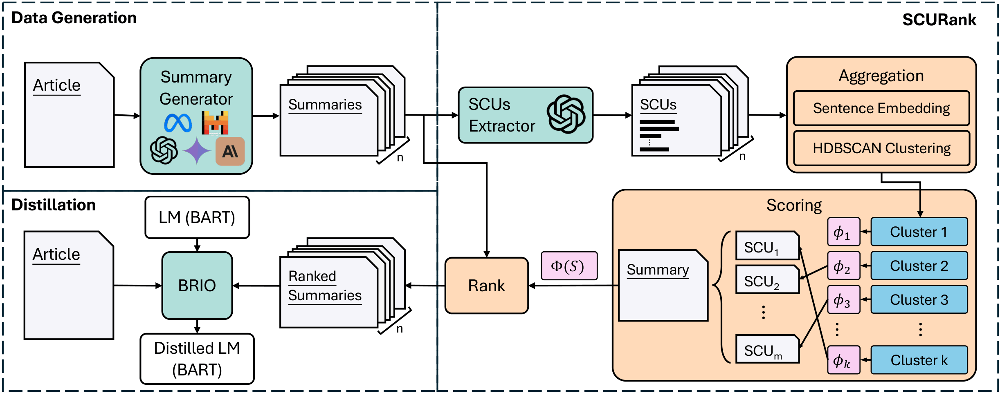

SCURank
===

This repository contains the code, data, and experiments for our paper: **SCURank: Ranking Multiple Candidate Summaries with Summary Content Units for Enhanced Summarization**


## Overview

We introduce **SCURank** (**S**ummary **C**ontent **U**nit **Rank**ing), a ranking framework that evaluates the information richness of candidate summaries by analyzing their SCUs.
SCURank operates in three stages.
First, it captures the key information in each summary by extracting SCUs.
Next, all SCUs are aggregated by clustering to estimate their importance based on their frequency across summaries.
Finally, each summary is assigned a score by summing the importance scores of its SCUs, which reflects its overall information richness.

<div align="center">
    
</div>

## Prerequisite

This repository uses [`uv`](https://docs.astral.sh/uv/getting-started/installation/) for environment management. Install dependencies with:

```bash
uv sync
```

## Repository Structure

- `scurank.py` — core SCURank ranking logic
- `gen_scu.py` — batch SCU generation via LLM API calls
- `pipeline.py` — end-to-end pipeline: summary generation → SCU extraction → ranking
- `build_train_data.py` — converts ranking results into training data format
- `prompts/` — prompt templates used across the pipeline
- `util/` — LLM backend integrations (OpenAI, Anthropic, Google Cloud)
- `utils.py` — shared utilities for calling LLMs and loading/saving data
- `experiments/` — all experimental results
  - `distilled_model_output/` — outputs from models distilled using different ranking methods
  - `human-compare/` — human evaluation comparing SCURank vs. GPTRank distilled models
  - `llms-compare/` — LLM-based evaluation comparing SCURank vs. GPTRank distilled models
  - `stability/` — stability comparison across LLM-based ranking methods


## SCURank

### 0. Data Preparation

SCURank expects data in `.jsonl` format, where each line is a JSON object with the following fields:

| Field | Type | Description |
|---|---|---|
| `article` | `str` | The source document to be summarized |
| `candidates` | `dict[str, str]` or `list[str]` | Candidate summaries, keyed by model name or as a plain list |
| `scus` | `dict[str, list[str]]` or `list[list[str]]` | SCUs for each candidate (same keys/order as `candidates`) |

Example (dict form, one line of your `.jsonl`):

```json
{
  "article": "Tom Daley had a disappointing outing ...",
  "candidates": {
    "gpt-4o-mini": "Tom Daley failed to qualify for the 10m platform final ...",
    "mistral-large": "Tom Daley, London 2012 bronze medalist, failed to qualify ..."
  },
  "scus": {
    "gpt-4o-mini": ["Tom Daley failed to qualify for the final.", "The event was in Beijing.", "..."],
    "mistral-large": ["Tom Daley is a London 2012 bronze medalist.", "..."]
  }
}
```

The `scus` field is optional if you plan to generate them on the fly (see Section 3). Place your files under `data/<dataset_name>/` as:

```
data/
└── <dataset_name>/
    ├── candidates.jsonl      # training split
    └── candidates-val.jsonl  # validation split
```

---

### 1. Quickstart (End-to-End Pipeline)

Use `pipeline.py` to run the full pipeline on a single article — summary generation, SCU extraction, and ranking — in one shot.

```bash
uv run pipeline.py
```

The pipeline internally does three things:

1. **Summary Generation** — calls multiple LLMs to produce candidate summaries for your article.
2. **SCU Extraction** — extracts Summary Content Units from each candidate using `gpt-4o-mini`.
3. **Ranking** — runs SCURank to score and rank candidates by information richness.

You can edit the `models` list in `pipeline.py` to swap in different LLMs (OpenAI, Gemini, Anthropic, xAI, LLaMA, Mistral are supported out of the box).

---

### 2. Generating SCUs first, then ranking (Recommended for large datasets)

Pre-generating SCUs via batch API calls saves tokens and cost when ranking many documents.

**Step 1 — Generate SCUs in batch:**

```bash
uv run gen_scu.py
```

This writes SCUs to a `.jsonl` file that can be reused across multiple ranking runs.

**Step 2 — Run SCURank with pre-generated SCUs:**

```python
from scurank import scurank
from utils import load_jsonl

data = load_jsonl("data/cnn_llms/candidates.jsonl")  # must contain "scus" field
ranks = scurank(data, cluster_type="hdbscan", emb_type="all-mpnet-base-v2")
```

Each entry in `ranks` is a list where the value at index `i` is the rank of the `i`-th candidate (1 = best).

---

### 3. SCURank with on-the-fly SCU generation

If your data does not have pre-generated SCUs, set `is_generate_scus=True` to generate them on the fly. This is simpler but slower and more expensive.

```python
from scurank import scurank
from utils import load_jsonl

data = load_jsonl("data/cnn_llms/candidates.jsonl")  # only needs "candidates" field
ranks = scurank(data, cluster_type="hdbscan", emb_type="all-mpnet-base-v2", is_generate_scus=True)
```

Generated SCUs are automatically saved to `scus.jsonl` for future use.

---

### 4. Running from the command line

```bash
# Basic run (requires pre-generated SCUs in the data)
uv run scurank.py --type cnn_llms --cluster hdbscan --emb all-mpnet-base-v2

# Generate SCUs on the fly during ranking
uv run scurank.py --type cnn_llms --cluster hdbscan --is_generate_scus

# Use UMAP for dimensionality reduction before clustering
uv run scurank.py --type cnn_llms --cluster hdbscan-umap --is_umap
```

Available clustering algorithms: `hdbscan`, `hdbscan-umap`, `agglomerative`, `affinity`.


## Additional Notes

### 1. GPTRank vs. SCURank output format

The two methods use different rank result conventions.

**GPTRank** returns an ordered list of candidate indices from best to worst:
```
[7, 5, 3, 4, 2, 6, 1]
# candidate 7 is the best; candidate 1 is the worst
```

**SCURank** returns a per-candidate rank score, where the value at each index is the rank of that candidate:
```
[7, 5, 3, 4, 2, 6, 1]
# candidate at idx 0 is ranked 7th (worst); candidate at idx 6 is ranked 1st (best)
```

Use `build_train_data.py` to convert either format into a unified training data structure.

<!-- 
### 2. Start to use Google Cloud
---
In generation stage, it relies on googl cloud heavily. However, it is not as easy to use google cloud easily.
That's why there is a stage to talk how to initilize your google cloud in your computer.

First: Create a new account

Second: Go to the google cloud console online and open the service you want.
(I usually go to the vertex AI stage to open several API services from different LLMs.)

Third: Download gcloud through the guideline in your computer. [url](https://cloud.google.com/sdk/docs/install-sdk#deb)

Fourth: The most important stage. Finish the code below to get access from your project
```
gcloud init
gcloud auth login
gcloud auth application-default login
```
Fifth: Done! -->